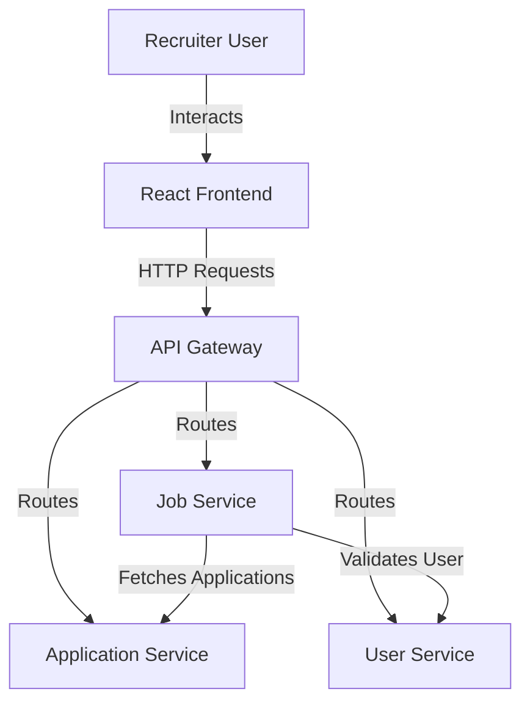
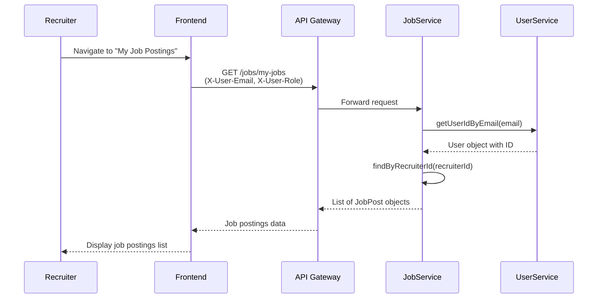
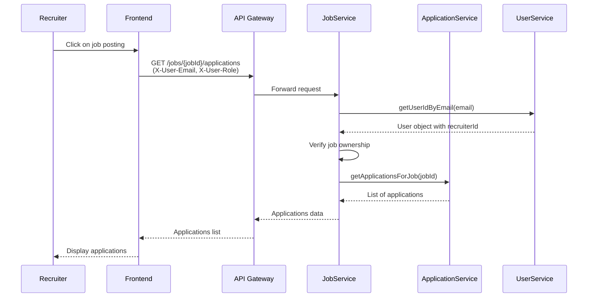

# Design Document: Recruiter Application Viewer

## Overview

This feature adds recruiter-specific functionality to the job portal header navigation, enabling recruiters to view their job postings and the applications submitted for each job. The design extends the existing navigation pattern used for job seekers' "My Applications" feature and leverages existing backend endpoints while adding new ones where needed.

The solution consists of:
- Frontend: New React components and pages for job postings list and application viewer
- Backend: New API endpoints in jobservice for retrieving applications with proper authorization
- Integration: Seamless integration with existing authentication and navigation systems

## Architecture

### System Context



### Component Architecture

The feature follows the existing microservices architecture:

1. **Frontend Layer** (React)
   - Header component (modified)
   - NavBar component (modified)
   - MyJobPostings page (new)
   - JobApplications page (new)

2. **API Gateway Layer**
   - Routes requests to appropriate microservices
   - No changes required (existing routing sufficient)

3. **Backend Services**
   - **jobservice**: Handles job postings and coordinates application retrieval
   - **ApplicationService**: Provides application data and resume file access
   - **user-service**: Validates user identity and role (existing)

### Data Flow

#### Viewing Job Postings


#### Viewing Applications for a Job


## Components and Interfaces

### Frontend Components

#### 1. NavBar Component (Modified)

**Location**: `jobPortal_frontend/src/components/navBar.jsx`

**Changes**:
- Add conditional rendering for "My Job Postings" link when user is a recruiter
- Use existing `isRecruiter()` utility function from auth.js

**Interface**:
```javascript
// No props - uses auth context internally
export default function NavBar()
```

**Behavior**:
- Check if user is authenticated and has RECRUITER role
- Display "My Job Postings" link in navigation menu
- Link navigates to `/my-job-postings` route

#### 2. MyJobPostings Component (New)

**Location**: `jobPortal_frontend/src/pages/MyJobPostings.jsx`

**Purpose**: Display list of all job postings created by the authenticated recruiter

**Interface**:
```javascript
export default function MyJobPostings()
```

**State**:
```javascript
{
  jobPostings: JobPost[],      // Array of job posting objects
  loading: boolean,             // Loading state
  error: string | null          // Error message if fetch fails
}
```

**JobPost Type**:
```typescript
interface JobPost {
  id: number;
  title: string;
  companyName: string;
  location: string;
  salary: number;
  applicationCount: number;
  time: string;  // ISO date string
}
```

**Behavior**:
- Fetch job postings on component mount using `/jobs/my-jobs` endpoint
- Display loading indicator while fetching
- Render job postings in a list/grid format
- Each job posting is clickable and navigates to `/my-job-postings/{jobId}/applications`
- Display empty state message if no job postings exist
- Display error message if API call fails

#### 3. JobApplications Component (New)

**Location**: `jobPortal_frontend/src/pages/JobApplications.jsx`

**Purpose**: Display all applications for a specific job posting

**Interface**:
```javascript
export default function JobApplications()
```

**State**:
```javascript
{
  applications: Application[],  // Array of application objects
  jobInfo: JobInfo | null,      // Job posting information for context
  loading: boolean,             // Loading state
  error: string | null          // Error message if fetch fails
}
```

**Application Type**:
```typescript
interface Application {
  id: number;
  seekerId: number;
  seekerEmail: string;
  jobId: number;
  resumePath: string;
  appliedAt: string;  // ISO date string
}

interface JobInfo {
  title: string;
  companyName: string;
}
```

**Behavior**:
- Extract jobId from URL parameters using React Router
- Fetch applications on component mount using `/jobs/{jobId}/applications` endpoint
- Display job title and company name at the top
- Render applications in a table format with columns: Applicant Email, Resume, Applied Date
- Provide download button for each resume
- Display empty state message if no applications exist
- Display error message if API call fails
- Provide back button to return to job postings list

### Backend Components

#### 1. JobPostController (Modified)

**Location**: `jobservice/src/main/java/com/jobportal/jobservice/JobPostController/JobPostController.java`

**Existing Endpoint** (already implemented):
```java
@GetMapping("/my-jobs")
public ResponseEntity<?> getAllJobPostedByRecruiter(
    @RequestHeader("X-User-Email") String email
)
```

**Existing Endpoint** (already implemented):
```java
@GetMapping("/{jobId}/applications")
public ResponseEntity<?> getJobApplications(
    @RequestHeader("X-User-Email") String email,
    @PathVariable Long jobId
)
```

**Note**: These endpoints already exist in the codebase and provide the necessary functionality. No modifications needed.

#### 2. JobApplicationClient (Existing)

**Location**: `jobservice/src/main/java/com/jobportal/jobservice/feignClient/JobApplicationClient.java`

**Existing Interface**:
```java
@GetMapping("/all/applications-list/{jobId}")
List<JobApplication> getApplicationsForJob(@PathVariable("jobId") Long jobId);
```

**Note**: This Feign client already exists and is used by the `/jobs/{jobId}/applications` endpoint.

#### 3. ApplicationService - Resume Download Endpoint (New)

**Location**: `ApplicationService/src/main/java/com/jobportal/ApplicationService/JobApplicationController/JobApplicationController.java`

**New Endpoint**:
```java
@GetMapping("/download-resume/{applicationId}")
public ResponseEntity<Resource> downloadResume(
    @RequestHeader("X-User-Email") String email,
    @RequestHeader("X-User-Role") String role,
    @PathVariable Long applicationId
)
```

**Behavior**:
- Validate user has RECRUITER role
- Fetch application by ID
- Verify recruiter owns the job posting (via Feign call to jobservice)
- Load resume file from file system
- Return file as Resource with appropriate headers:
  - Content-Type: application/pdf
  - Content-Disposition: attachment; filename="original-filename.pdf"
- Return 403 if recruiter doesn't own the job
- Return 404 if application or file not found

#### 4. FileStorageService (Modified)

**Location**: `ApplicationService/src/main/java/com/jobportal/ApplicationService/JobApplicationService/FileStorageService.java`

**New Method**:
```java
public Resource loadFileAsResource(String filePath) throws IOException
```

**Behavior**:
- Accept file path (e.g., "/uploads/resumes/filename.pdf")
- Load file from file system
- Return as Spring Resource for download
- Throw IOException if file not found

## Data Models

### Frontend Models

All data models are inferred from API responses. No explicit TypeScript interfaces are required for JavaScript implementation, but the structure is documented above for clarity.

### Backend Models

#### JobPost Entity (Existing)

**Location**: `jobservice/src/main/java/com/jobportal/jobservice/Entity/JobPost.java`

```java
@Entity
public class JobPost {
    private Long id;
    private String title;
    private String companyName;
    private String description;
    private String location;
    private Double salary;
    private LocalDateTime time;
    private Long recruiterId;
    private int applicationCount;
}
```

#### JobApplication Entity (Existing)

**Location**: `ApplicationService/src/main/java/com/jobportal/ApplicationService/Entity/JobApplication.java`

```java
@Entity
public class JobApplication {
    private Long id;
    private Long seekerId;
    private Long jobId;
    private String resumePath;
    private LocalDateTime appliedAt;
}
```

**Note**: The seeker email is not stored in the application entity. It needs to be fetched from user-service or added to the response DTO.

#### Enhanced Application Response DTO (New)

**Location**: `ApplicationService/src/main/java/com/jobportal/ApplicationService/JobApplicationDto/ApplicationResponseDto.java`

```java
public class ApplicationResponseDto {
    private Long id;
    private Long seekerId;
    private String seekerEmail;  // Fetched from user-service
    private Long jobId;
    private String resumePath;
    private LocalDateTime appliedAt;
}
```

**Purpose**: Provide complete application information including seeker email for display in the frontend.

## Correctness Properties

*A property is a characteristic or behavior that should hold true across all valid executions of a system—essentially, a formal statement about what the system should do. Properties serve as the bridge between human-readable specifications and machine-verifiable correctness guarantees.*


### Property 1: Role-based Navigation Visibility
*For any* authenticated user, the "My Job Postings" navigation item should be visible if and only if the user has the RECRUITER role.
**Validates: Requirements 1.1, 1.2**

### Property 2: Navigation Link Routing
*For any* navigation link click (My Job Postings or job posting selection), the application should navigate to the correct route with appropriate parameters.
**Validates: Requirements 1.3, 2.3**

### Property 3: Job Postings API Call
*For any* recruiter navigating to the job postings page, the frontend should make a GET request to `/jobs/my-jobs` with correct authentication headers.
**Validates: Requirements 2.1**

### Property 4: Job Posting Display Completeness
*For any* job posting returned from the API, the frontend should display all required fields: title, company name, location, and application count.
**Validates: Requirements 2.2**

### Property 5: API Error Handling
*For any* API request failure (job postings or applications), the frontend should display an appropriate error message to the user.
**Validates: Requirements 2.5, 3.4, 4.3**

### Property 6: Applications API Call
*For any* job posting selection, the frontend should make a GET request to `/jobs/{jobId}/applications` with the correct job ID and authentication headers.
**Validates: Requirements 3.1**

### Property 7: Application Display Completeness
*For any* application returned from the API, the frontend should display all required fields: applicant email, resume file name, and submission date.
**Validates: Requirements 3.2**

### Property 8: Job Context Display
*For any* applications page, the frontend should display the job title and company name at the top of the page.
**Validates: Requirements 3.5**

### Property 9: Resume Download UI
*For any* application displayed, the frontend should render a download button or link for the resume.
**Validates: Requirements 4.1**

### Property 10: Resume Download Action
*For any* resume download button click, the frontend should initiate a download request with the correct application ID and preserve the original filename in the downloaded file.
**Validates: Requirements 4.2, 4.4**

### Property 11: Backend Response Structure - Job Postings
*For any* valid authenticated recruiter request to `/jobs/my-jobs`, the backend should return a list where each job posting contains all required fields: id, title, company name, location, salary, and application count.
**Validates: Requirements 5.2**

### Property 12: Backend Authentication Headers
*For any* backend endpoint request, the system should extract and use the X-User-Email and X-User-Role headers for authentication and authorization.
**Validates: Requirements 5.5**

### Property 13: Backend Response Structure - Applications
*For any* valid authorized request to `/jobs/{jobId}/applications`, the backend should return a list where each application contains all required fields: seeker email, resume path, and submission timestamp.
**Validates: Requirements 6.2**

### Property 14: Job Ownership Verification
*For any* request to view applications or download resumes, the backend should verify that the requesting recruiter owns the associated job posting before granting access.
**Validates: Requirements 6.6, 8.2**

### Property 15: Resume Download Headers
*For any* successful resume download request, the backend should return the file with Content-Type set to application/pdf and Content-Disposition header containing the original filename.
**Validates: Requirements 7.2, 7.5**

### Property 16: Role-based Authorization
*For any* request to recruiter-specific endpoints, the backend should validate that the authenticated user has the RECRUITER role and return 403 Forbidden if the role is incorrect.
**Validates: Requirements 8.1**

### Property 17: Authorization Error Codes
*For any* authorization failure, the backend should return 401 Unauthorized for missing authentication and 403 Forbidden for insufficient permissions.
**Validates: Requirements 8.3**

### Property 18: Security Audit Logging
*For any* access attempt to application data (view applications or download resume), the backend should create a log entry for security auditing.
**Validates: Requirements 8.4**

### Property 19: Unauthenticated Access Redirect
*For any* unauthenticated user attempting to access recruiter-only pages, the frontend should redirect to the login page.
**Validates: Requirements 8.5**

### Property 20: Navigation Elements Presence
*For any* recruiter page (job postings list or applications view), the frontend should provide a back button or link to navigate to the previous page.
**Validates: Requirements 9.1, 9.2**

### Property 21: Loading Indicators
*For any* data fetch operation, the frontend should display a loading indicator while the request is in progress.
**Validates: Requirements 9.3**

### Property 22: URL Routing
*For any* navigation action, the frontend should update the browser URL to reflect the current page, enabling direct linking and browser back/forward navigation.
**Validates: Requirements 9.5**

## Error Handling

### Frontend Error Handling

1. **Network Errors**
   - Display user-friendly error messages when API calls fail
   - Provide retry mechanisms where appropriate
   - Log errors to console for debugging

2. **Authentication Errors**
   - Redirect to login page on 401 Unauthorized responses
   - Clear stored authentication tokens
   - Display message indicating session expired

3. **Authorization Errors**
   - Display message indicating insufficient permissions on 403 Forbidden
   - Provide link to return to home page or previous page

4. **Not Found Errors**
   - Display message indicating resource not found on 404 responses
   - Provide navigation back to job postings list

5. **Validation Errors**
   - Display specific error messages for invalid inputs
   - Highlight problematic fields in forms

### Backend Error Handling

1. **Authentication Failures**
   - Return 401 Unauthorized when X-User-Email or X-User-Role headers are missing
   - Return 401 when token validation fails
   - Log authentication failures for security monitoring

2. **Authorization Failures**
   - Return 403 Forbidden when user role is not RECRUITER
   - Return 403 when recruiter attempts to access another recruiter's data
   - Log authorization failures with user details

3. **Resource Not Found**
   - Return 404 Not Found when job posting doesn't exist
   - Return 404 when application doesn't exist
   - Return 404 when resume file is not found on file system
   - Include descriptive error messages in response body

4. **Service Communication Errors**
   - Implement circuit breakers for Feign client calls
   - Return 503 Service Unavailable when dependent services are down
   - Provide fallback responses where possible
   - Log service communication failures

5. **File System Errors**
   - Handle IOException when reading resume files
   - Return 500 Internal Server Error with generic message
   - Log detailed error information for debugging
   - Ensure sensitive file paths are not exposed to clients

6. **Data Validation Errors**
   - Validate path parameters (jobId, applicationId) are valid numbers
   - Return 400 Bad Request for invalid inputs
   - Provide clear error messages indicating what was invalid

### Error Response Format

All error responses should follow a consistent format:

```json
{
  "timestamp": "2024-01-15T10:30:00Z",
  "status": 404,
  "error": "Not Found",
  "message": "Job posting with ID 123 not found",
  "path": "/jobs/123/applications"
}
```

## Testing Strategy

### Unit Testing

Unit tests should focus on specific examples, edge cases, and error conditions:

**Frontend Unit Tests**:
- Test component rendering with mock data
- Test empty state displays (no job postings, no applications)
- Test error state displays (API failures, 404 errors)
- Test navigation link clicks
- Test download button clicks
- Test authentication redirect logic
- Test loading state displays

**Backend Unit Tests**:
- Test endpoint handlers with valid inputs
- Test authentication header extraction
- Test authorization logic (role validation, ownership verification)
- Test error responses (401, 403, 404, 500)
- Test file loading and resource creation
- Test response DTO mapping
- Test Feign client interactions with mocks

### Property-Based Testing

Property tests should verify universal properties across all inputs. Each test should run a minimum of 100 iterations.

**Frontend Property Tests**:
- Property 1: Role-based navigation visibility (generate random user roles)
- Property 2: Navigation routing (generate random job IDs and verify correct URLs)
- Property 4: Job posting display completeness (generate random job postings, verify all fields rendered)
- Property 7: Application display completeness (generate random applications, verify all fields rendered)
- Property 9: Resume download UI (generate random applications, verify download buttons exist)
- Property 21: Loading indicators (generate random API delays, verify loading states)

**Backend Property Tests**:
- Property 11: Job postings response structure (generate random recruiter data, verify response fields)
- Property 13: Applications response structure (generate random application data, verify response fields)
- Property 14: Job ownership verification (generate random recruiter/job combinations, verify access control)
- Property 15: Resume download headers (generate random resume files, verify headers)
- Property 16: Role-based authorization (generate random user roles, verify access control)
- Property 17: Authorization error codes (generate various auth failure scenarios, verify status codes)
- Property 18: Security audit logging (generate random access attempts, verify log entries created)

**Test Configuration**:
- Minimum 100 iterations per property test
- Use appropriate property-based testing library (fast-check for JavaScript, JUnit QuickCheck for Java)
- Tag each test with: **Feature: recruiter-application-viewer, Property {number}: {property_text}**

### Integration Testing

Integration tests should verify end-to-end flows:

1. **Recruiter Views Job Postings Flow**
   - Authenticate as recruiter
   - Navigate to My Job Postings
   - Verify job postings are fetched and displayed
   - Verify all job posting fields are present

2. **Recruiter Views Applications Flow**
   - Authenticate as recruiter
   - Navigate to My Job Postings
   - Click on a job posting
   - Verify applications are fetched and displayed
   - Verify all application fields are present

3. **Recruiter Downloads Resume Flow**
   - Authenticate as recruiter
   - Navigate to applications for a job
   - Click download button
   - Verify file download is initiated
   - Verify file content and filename are correct

4. **Authorization Failure Flows**
   - Attempt to access recruiter pages as seeker (verify 403)
   - Attempt to view another recruiter's applications (verify 403)
   - Attempt to download resume for another recruiter's job (verify 403)

5. **Error Handling Flows**
   - Simulate API failures (verify error messages)
   - Request non-existent job (verify 404 handling)
   - Request non-existent application (verify 404 handling)

### Testing Tools

- **Frontend**: Jest, React Testing Library, fast-check (property-based testing)
- **Backend**: JUnit 5, Mockito, JUnit QuickCheck (property-based testing), MockMvc
- **Integration**: Testcontainers for database, WireMock for service mocking
- **E2E**: Playwright or Cypress for full user flow testing

## Implementation Notes

### Frontend Implementation

1. **Routing**
   - Add routes in App.jsx for `/my-job-postings` and `/my-job-postings/:jobId/applications`
   - Use React Router's `useParams` hook to extract jobId in JobApplications component

2. **API Integration**
   - Use existing `getAuthHeaders()` utility for authentication headers
   - Use fetch API or axios for HTTP requests
   - Handle loading states with useState
   - Handle errors with try-catch and display user-friendly messages

3. **Styling**
   - Reuse existing CSS patterns from MyApplications component
   - Maintain consistent button styles, table layouts, and spacing
   - Ensure responsive design for mobile devices

### Backend Implementation

1. **Resume Download Endpoint**
   - Create new endpoint in JobApplicationController
   - Use FileStorageService to load file as Resource
   - Set appropriate response headers for file download
   - Implement authorization checks before file access

2. **Application Response Enhancement**
   - Create ApplicationResponseDto with seeker email field
   - Modify getApplicationsForJob to fetch seeker emails from user-service
   - Map JobApplication entities to ApplicationResponseDto objects

3. **Security**
   - Validate all path parameters
   - Verify recruiter role in all recruiter-specific endpoints
   - Verify job ownership before returning sensitive data
   - Log all access attempts with user email and timestamp

4. **Error Handling**
   - Use @ExceptionHandler for consistent error responses
   - Implement custom exceptions (JobNotFoundException, UnauthorizedException)
   - Provide meaningful error messages without exposing sensitive information

### Database Considerations

No database schema changes are required. The feature uses existing tables:
- `job_post` table (jobservice database)
- `job_application` table (ApplicationService database)
- `users` table (user-service database)

### Performance Considerations

1. **Caching**
   - Consider caching job postings list for recruiters (short TTL)
   - Cache application counts to reduce database queries
   - Invalidate cache when new applications are submitted

2. **Pagination**
   - Implement pagination for job postings list if recruiters have many jobs
   - Implement pagination for applications list if jobs have many applications
   - Use page size of 20-50 items for optimal performance

3. **File Downloads**
   - Stream large resume files instead of loading entirely into memory
   - Set appropriate buffer sizes for file streaming
   - Consider CDN or object storage for resume files in production

### Security Considerations

1. **Path Traversal Prevention**
   - Validate resume file paths to prevent directory traversal attacks
   - Use absolute paths or sanitize relative paths
   - Restrict file access to designated upload directory

2. **Data Privacy**
   - Only expose necessary applicant information to recruiters
   - Do not expose seeker IDs or internal identifiers in frontend
   - Mask or redact sensitive information in logs

3. **Rate Limiting**
   - Implement rate limiting on download endpoints to prevent abuse
   - Limit number of concurrent downloads per recruiter
   - Monitor for suspicious download patterns

4. **CORS Configuration**
   - Ensure API Gateway has appropriate CORS settings
   - Restrict allowed origins to frontend domain
   - Validate Origin header in requests

## Deployment Considerations

### Frontend Deployment

1. Build optimized production bundle
2. Update environment variables for API endpoints
3. Deploy to hosting service (Vercel, Netlify, or S3 + CloudFront)
4. Verify routing works correctly with production URLs

### Backend Deployment

1. **ApplicationService**
   - Deploy new version with resume download endpoint
   - Ensure file storage path is correctly configured
   - Verify file system permissions for resume directory

2. **jobservice**
   - No deployment changes required (endpoints already exist)
   - Verify Feign client configuration for ApplicationService

3. **API Gateway**
   - No routing changes required
   - Verify request forwarding to services

### Database Migration

No database migrations required for this feature.

### Monitoring and Observability

1. **Metrics to Track**
   - Number of job postings viewed per recruiter
   - Number of applications viewed per job
   - Number of resume downloads per recruiter
   - API response times for new endpoints
   - Error rates for authorization failures

2. **Logging**
   - Log all access to application data (who, what, when)
   - Log authorization failures with details
   - Log file download attempts and outcomes
   - Log API errors with stack traces

3. **Alerts**
   - Alert on high error rates for new endpoints
   - Alert on authorization failure spikes (potential attack)
   - Alert on file system errors (disk space, permissions)
   - Alert on slow API response times

## Future Enhancements

Potential future improvements to consider:

1. **Application Filtering and Sorting**
   - Filter applications by date range
   - Sort by application date, applicant name
   - Search applications by applicant email

2. **Application Status Management**
   - Add status field to applications (pending, reviewed, accepted, rejected)
   - Allow recruiters to update application status
   - Send notifications to applicants on status changes

3. **Bulk Actions**
   - Download multiple resumes as ZIP file
   - Bulk status updates for applications
   - Export applications to CSV

4. **Analytics Dashboard**
   - View application trends over time
   - Compare application rates across jobs
   - Track time-to-hire metrics

5. **Applicant Communication**
   - Send messages to applicants directly from the platform
   - Schedule interviews through the application
   - Track communication history

6. **Resume Parsing**
   - Extract structured data from resumes
   - Display key information (skills, experience) in application list
   - Enable searching by skills or qualifications
